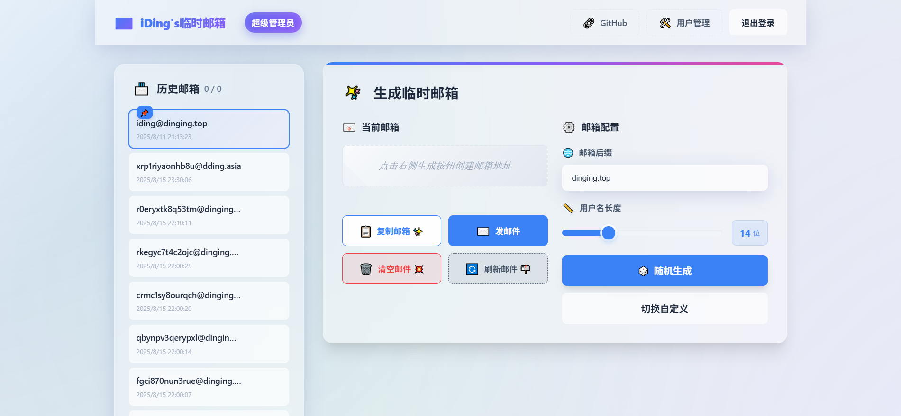
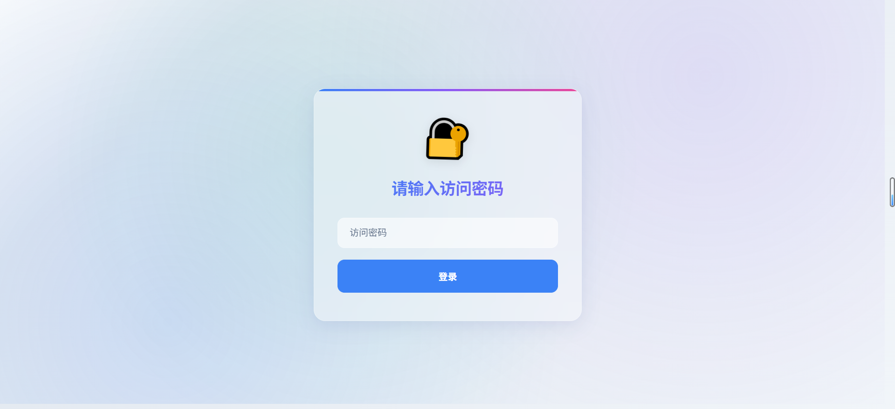

# 临时邮箱 Cloudflare Worker（模块化结构）

当前状态：V2 功能已完成

一个基于 Cloudflare Workers 和 D1 数据库的临时邮箱服务。

## 📸 项目展示
### 体验地址： https://mailexhibit.dinging.top/

### 体验密码： admin
### 首页


### 登录/密码保护


### 邮件内容查看（HTML 渲染）


### 便捷复制验证码


### 发件测试（发送弹窗）


### 发件测试（收件结果）


## 功能特性

### 🎨 现代化界面
- 🌈 **毛玻璃效果**：采用现代化的毛玻璃（Glassmorphism）设计风格
- 🎯 **简约美观**：浅色背景，动态渐变，视觉效果出色
- 📱 **响应式设计**：完美适配桌面和移动设备
- ✨ **动画效果**：平滑的过渡动画和微交互反馈

### 📧 邮箱管理
- 🎲 **智能生成**：随机生成临时邮箱地址，支持自定义长度和域名
- 📋 **历史记录**：自动保存历史生成的邮箱，方便重复使用
- 🗑️ **便捷删除**：支持删除单个邮箱和批量管理
- 🔄 **一键切换**：快速在不同邮箱间切换

### 💌 邮件功能
- 📧 **实时接收**：自动接收和显示邮件，支持HTML和纯文本
- 🔄 **自动刷新**：选中邮箱后每8秒自动检查新邮件
- 🔍 **智能预览**：自动提取和高亮显示验证码内容
- 📖 **详细查看**：优化的邮件详情显示，支持完整内容渲染
- 📋 **一键复制**：智能识别验证码并优先复制，或复制完整邮件内容
- 🗑️ **灵活删除**：支持删除单个邮件或清空整个邮箱
- ✉️ **发件支持（Resend）**：已接入 Resend，可使用临时邮箱地址发送邮件并查看发件记录（发件箱），支持自定义发件显示名（`fromName`）与批量/定时/取消等能力。详情见《[Resend 密钥获取与配置教程](docs/resend.md)》

## 版本与路线图

### V1
- 前后端基础功能与认证体系
- 邮箱生成、历史记录、邮件列表与详情、清空/删除
- 智能验证码提取与复制、一键复制邮件内容
- 自动刷新与基本的 UI 交互

### V2
- [x] 前端模板解耦：将首页 UI 从 `public/app.js` 内联模板拆分为独立的 `public/templates/app.html`，降低耦合、便于维护
- [x] 发件（Resend）与发件箱：支持通过 Resend 发送邮件、自定义发件显示名（`fromName`）


### 🔧 技术特性
- ⚡ **基于 Cloudflare**：利用全球网络，访问速度快
- 💾 **D1 数据库**：可靠的数据存储，支持数据持久化
- 🔐 **安全认证**：内置登录系统，保护数据安全
- 🎯 **API 完善**：提供完整的 RESTful API 接口

## 部署步骤

### 1. 创建 D1 数据库

##Cloudflare在线创建也可以

```bash
# 安装 Wrangler CLI
npm install -g wrangler

# 登录 Cloudflare
wrangler login

# 创建 D1 数据库
wrangler d1 create temp-mail-db
```

### 2. 配置 wrangler.toml（已改为模块化入口）

复制返回的数据库 ID，更新 `wrangler.toml` 文件：

```toml
main = "src/index.js"

[[d1_databases]]
binding = "TEMP_MAIL_DB"
database_name = "temp-mail-db"
database_id = "你的数据库ID"

[vars]
MAIL_DOMAIN = "你的域名.com，域名2.cn" #可以多个 以英文逗号分隔
# （可选）如果需要发件：不在此处明文配置，将密钥以 Secret 方式注入
# RESEND_API_KEY 在部署时通过 wrangler 或 Dashboard 设置
```

### 3. 本地与线上部署（推荐 wrangler）

1) 本地开发
```bash
npm i -g wrangler
wrangler login
# 可在 wrangler.toml 的 [vars] 中配置本地变量（仅用于 dev/deploy via wrangler）
wrangler dev
```

2) 线上部署
```bash
# 设置敏感变量（Secret）
wrangler secret put ADMIN_PASSWORD
wrangler secret put JWT_TOKEN
# （可选，如需发件）设置 Resend 密钥
wrangler secret put RESEND_API_KEY
# 非敏感变量可放在 wrangler.toml 的 [vars] 或控制台 Variables 中
wrangler deploy
```

> 提示：如需开启发件功能，还需在 Resend 完成发信域名验证并创建 API Key。不会配置？请查看《[Resend 密钥获取与配置教程](docs/resend.md)》。

3) Cloudflare 连接github仓库部署
- 如果使用 Git 集成而非 wrangler deploy，请在 Dashboard → Workers → Settings → Variables 中手动配置上述变量
- `[assets]` 已指向 `public/`，静态页面由 Workers + Assets 提供

### 3.5 初始化 D1 表结构（首次部署）
只要绑定了d1 默认可以自行创建，如果不能自动创建再手动创建
```bash
# 方式一：表结构
wrangler d1 execute TEMP_MAIL_DB --file=./d1-init-basic.sql
```

### 4. 配置邮件路由（必需用于收取真实邮件）

如果需要接收真实邮件，需要在 Cloudflare 控制台配置邮件路由：

1. 进入域名的 Email Routing 设置
2. 添加 Catch-all 规则
3. 目标设置为 Worker: `temp-mail-worker`

### 5. 设置自定义域名（可选）

在 Worker 设置中添加自定义域名，或使用 workers.dev 子域名。

## 环境变量说明

| 变量名 | 说明 | 必需 |
|--------|------|------|
| TEMP_MAIL_DB | D1 数据库绑定 | 是 |
| MAIL_DOMAIN | 用于生成临时邮箱的域名，支持多个，使用逗号或空格分隔（如 `iding.asia, example.com`） | 是 |
| ADMIN_PASSWORD | 后台访问密码（登录页使用） | 是 |
| JWT_TOKEN / JWT_SECRET | JWT 签名密钥（二选一，推荐 `JWT_TOKEN`） | 是 |
| RESEND_API_KEY | Resend 发件 API Key。使用发件功能需要配置 | 否 |
| FORWARD_RULES | 邮件转发（转发到指定邮箱）。支持两种格式：`JSON 数组` 或 `逗号分隔 KV` | 否 |

> 发件相关的域名验证与密钥创建步骤，请参考《[docs/resend.md](docs/resend.md)》；如果你不清楚如何配置，请直接按照教程一步步操作。
### FORWARD_RULES 示例
> 说明：规则按前缀匹配，命中第一个前缀即转发；`*` 为兜底规则。未配置或设置为空/disabled/none 时不进行任何转发。

- 逗号分隔（KV）：
  - `FORWARD_RULES="vip=a@example.com,news=b@example.com,*=fallback@example.com"`
- JSON 数组：
  - `FORWARD_RULES='[{"prefix":"vip","email":"a@example.com"},{"prefix":"*","email":"fallback@example.com"}]'`
- 仅指定某些前缀（无兜底）：
  - `FORWARD_RULES="code=a@example.com,login=b@example.com"`
- 禁用转发：
  - `FORWARD_RULES=""` 或 `FORWARD_RULES="disabled"` 或 `FORWARD_RULES="none"` 或 `FORWARD_RULES="[]"`
  转发的目标地址需要在cloudfllare的电子邮件地址添加上

## API 接口

### 🎲 邮箱管理
- `GET /api/generate` - 生成新的临时邮箱
  - 返回: `{ "email": "random@domain.com", "expires": timestamp }`
- `GET /api/mailboxes` - 获取历史邮箱列表
  - 参数: `limit`（页面大小）, `offset`（偏移量）
  - 返回: 邮箱列表数组
- `DELETE /api/mailbox/{address}` - 删除指定邮箱
  - 返回: `{ "success": true }`

### 📧 邮件操作
- `GET /api/emails?mailbox=email@domain.com` - 获取邮件列表
  - 返回: 邮件列表数组，包含发件人、主题、时间等信息
- `GET /api/email/{id}` - 获取邮件详情
  - 返回: 完整的邮件内容，包括HTML和纯文本
- `DELETE /api/email/{id}` - 删除单个邮件
  - 返回: `{ "success": true, "deleted": true, "message": "邮件已删除" }`
- `DELETE /api/emails?mailbox=email@domain.com` - 清空邮箱所有邮件
  - 返回: `{ "success": true, "deletedCount": 5, "previousCount": 5 }`

### 🔐 认证相关
- `POST /api/session` - 用户登录
  - 参数: `{ "password": "密码" }`
  - 返回: JWT Token
- `POST /api/logout` - 用户退出
  - 返回: `{ "success": true }`

### 🔧 系统接口
- `GET /api/domains` - 获取可用域名列表
  - 返回: 域名数组

## 注意事项
- **静态资源缓存**：Workers + Assets 对静态文件可能有缓存。更新 `index.html` 后如未生效，请在 Cloudflare 控制台进行 `Purge Everything`，并在浏览器执行强制刷新（Ctrl/Cmd+F5）。
- **图标路径**：favicon 建议使用相对路径（例如 `favicon.svg`），避免挂在子路径时 404。
- **邮件路由**：若需接收真实邮件，请正确配置 Cloudflare Email Routing（MX 记录、Catch‑all → 绑定到 Worker）。
- **数据库与费用**：D1 有免费额度限制；建议定期清理过期邮件以节省存储空间与额度。
- **安全**：务必在生产环境修改 `ADMIN_PASSWORD`、`JWT_TOKEN`，并限制仓库/项目的敏感信息暴露。

## Resend 教程（发件）

- 教程文档：请见《[Resend 密钥获取与配置教程](docs/resend.md)》。
  - 覆盖域名验证、创建 API Key、在 Cloudflare Workers 设置 `RESEND_API_KEY` Secret 的完整流程
  - 详细列出后端发件相关接口（`/api/send`、`/api/send/batch`、`/api/send/:id`、`/api/send/:id/cancel`、`/api/sent` 等）与示例
  - 前端已集成“发件箱”，在生成/选择邮箱后可直接发信并查看记录；自定义发件显示名通过 `fromName` 字段传入

### 发件相关 API（摘要）
- `POST /api/send` 发送单封邮件（支持 `fromName` 自定义发件显示名）
- `POST /api/send/batch` 批量发送
- `GET /api/send/:id` 查询单封邮件发送状态
- `PATCH /api/send/:id` 更新（如定时 `scheduledAt`）
- `POST /api/send/:id/cancel` 取消发送
- `GET /api/sent?from=xxx@domain` 获取发件记录列表
- `GET /api/sent/:id` 获取发件详情
- `DELETE /api/sent/:id` 删除发件记录

完整用法与注意事项请参考《[docs/resend.md](docs/resend.md)》。

## 变更日志（节选）

- 前端模板外置（V2 里程碑之一）
  - 将首页内联 HTML 从 `public/app.js` 抽离为 `public/templates/app.html`
  - 将 `public/index.html` 的脚本标签改为模块：`<script type="module" src="app.js"></script>`
  - 在 `public/app.js` 中使用顶层 `await` 动态加载模板并再执行 DOM 初始化/会话校验，初始化顺序更安全
  - 影响范围：仅静态资源路径，需确保 `/templates/app.html` 可通过静态资源服务访问（默认 `public/` 下已生效）

- 发件（Resend）支持与配置
  - 新增后端发件能力与发件箱，支持 `fromName` 自定义发件显示名、批量/定时/取消
  - 新增环境变量 `RESEND_API_KEY`（以 Secret 提供）。配置与用法详见《[docs/resend.md](docs/resend.md)》

## 自定义配置

可以通过修改 Worker 代码来自定义：

- 邮箱地址生成规则
- 邮件保存时间
- 界面样式（`public/` 内的 HTML/CSS/JS）
- 功能扩展

## 🛠️ 故障排除

### 常见问题
1. **邮件接收不到**
   - 检查 Cloudflare 邮件路由配置是否正确
   - 确认域名的 MX 记录设置
   - 验证 MAIL_DOMAIN 环境变量配置

2. **数据库连接错误**
   - 确认 D1 数据库绑定名称为 TEMP_MAIL_DB
   - 检查 wrangler.toml 中的数据库 ID 是否正确
   - 运行 `wrangler d1 list` 确认数据库存在

3. **登录问题**
   - 确认 ADMIN_PASSWORD 环境变量已设置
   - 检查 JWT_TOKEN 或 JWT_SECRET 配置
   - 尝试清除浏览器缓存和 Cookie

4. **界面显示异常**
   - 确认静态资源路径配置正确
   - 检查浏览器控制台是否有 JavaScript 错误
   - 验证 CSS 文件加载是否正常

5. **自动刷新不工作**
   - 确认已选中邮箱地址
   - 检查浏览器是否支持 Page Visibility API
   - 查看网络连接是否稳定

### 调试技巧
- 使用 `wrangler dev` 进行本地调试
- 查看 Worker 的实时日志：`wrangler tail`
- 使用浏览器开发者工具检查网络请求
- 检查 D1 数据库中的数据：`wrangler d1 execute TEMP_MAIL_DB --command "SELECT * FROM mailboxes LIMIT 10"`

## 联系方式

- 微信：`iYear1213`

## Buy me a coffee

如果你觉得本项目对你有帮助，欢迎赞赏支持：

<p align="left">
  
  
</p>


## 许可证

Apache-2.0 license
